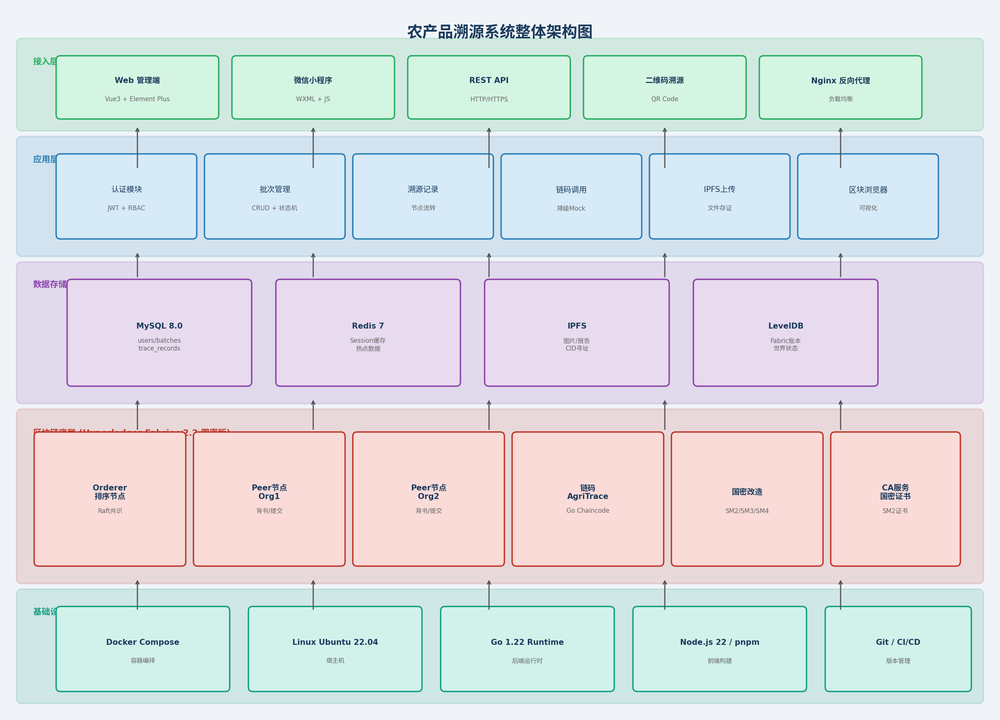
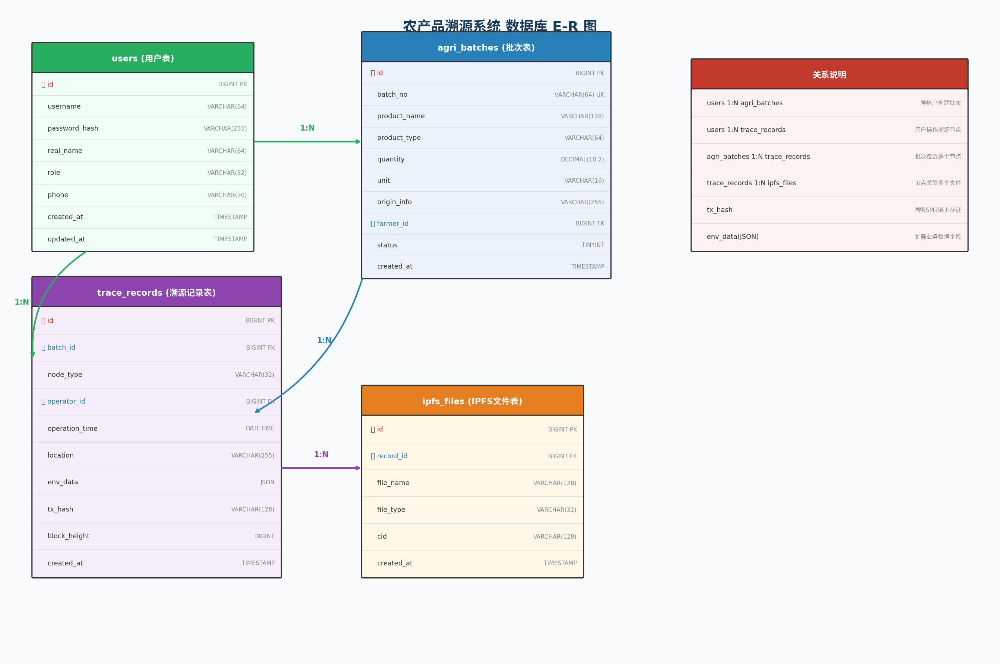
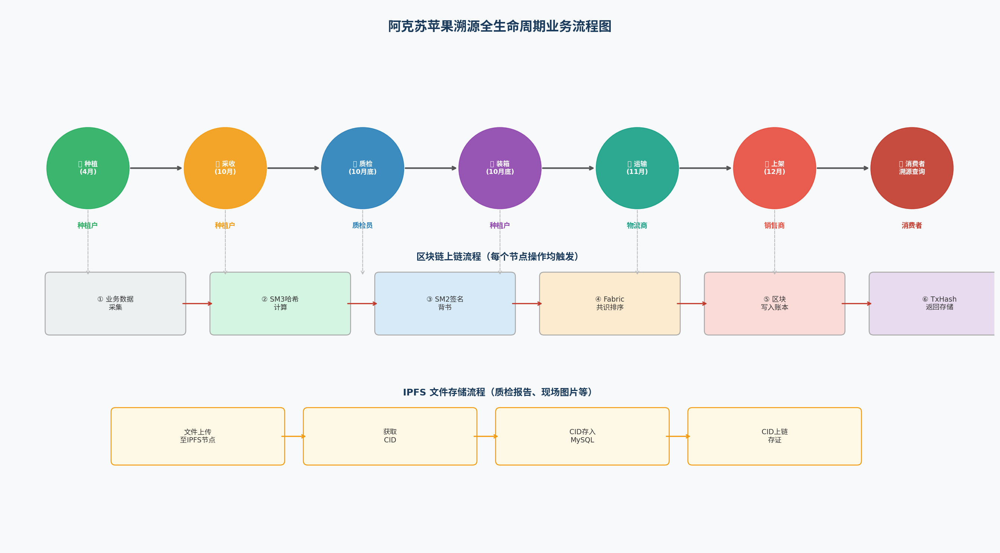
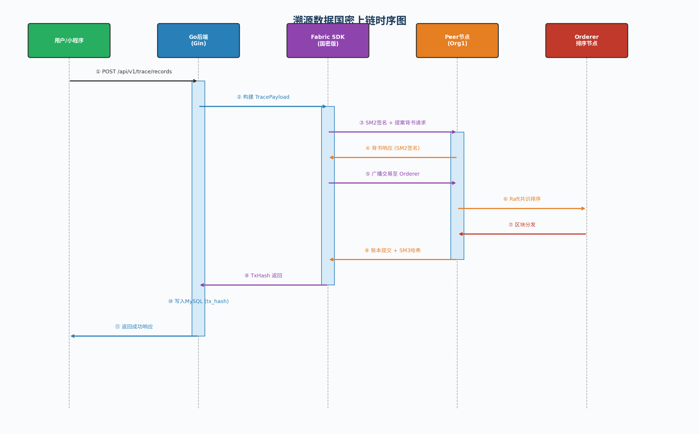
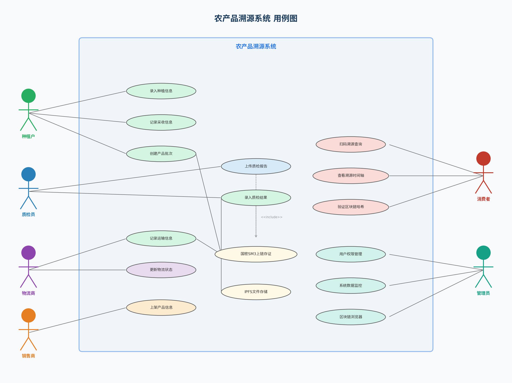
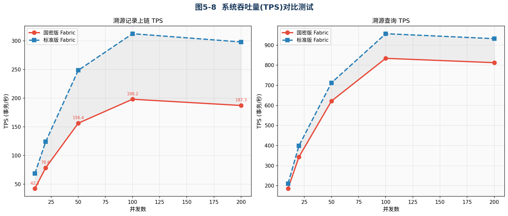
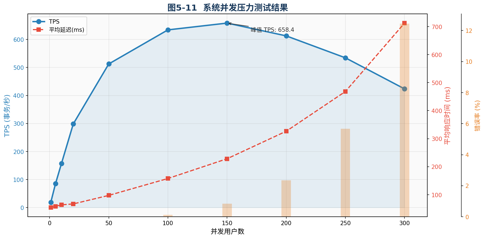
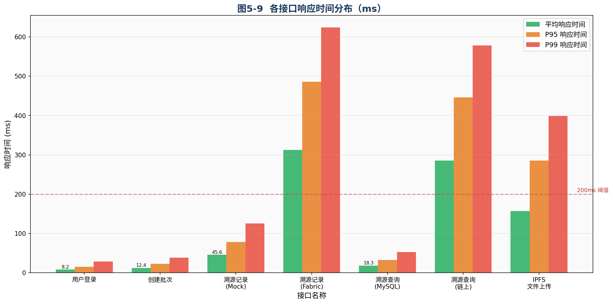
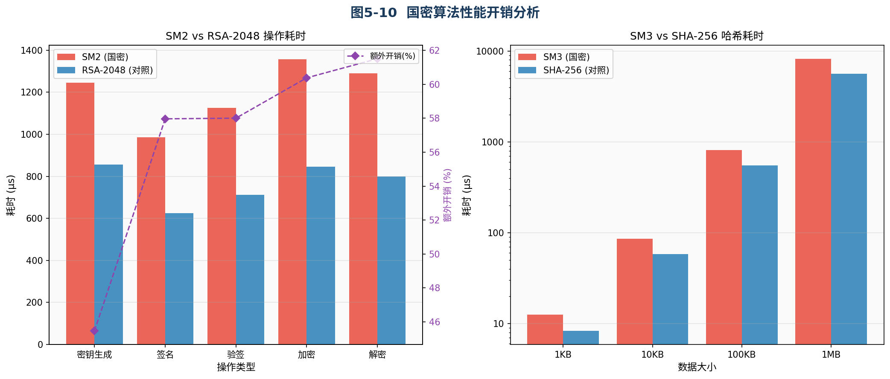

# 第五章 溯源系统实现与测试评估

在完成了基于国密算法的 Fabric 区块链底层改造以及溯源模型的整体设计后，本章将以“阿克苏苹果”作为具体应用实例，对农产品溯源系统进行全面的工程化落地与系统实现。本章首先阐述系统的开发环境与整体架构，随后详细展示系统的核心功能模块与数据库设计，最后通过 Caliper 等测试工具对系统的性能及国密算法的开销进行客观的量化评估，以验证本文所提方案的可行性与优越性。

## 5.1 系统开发环境与技术架构

### 5.1.1 软硬件运行环境

为保证系统的高效运行与稳定性，本系统采用分布式微服务架构进行部署。底层区块链网络与后端业务服务均运行于 Linux 环境中，通过 Docker 容器化技术进行隔离与编排。系统具体的软硬件配置参数如表 5-1 所示。

**表 5-1 系统软硬件运行环境配置表**

| 环境类型 | 组件/依赖名称 | 版本/配置 | 说明 |
| :--- | :--- | :--- | :--- |
| **硬件环境** | CPU | 8核 Intel Xeon | 支撑高并发加密运算 |
| | 内存 | 16 GB | 保障 Fabric 节点稳定运行 |
| | 存储 | 500 GB SSD | 用于区块账本与 IPFS 文件存储 |
| **系统环境** | 操作系统 | Ubuntu 22.04 LTS | 宿主机操作系统 |
| | 容器引擎 | Docker 24.0+ & Docker Compose | 实现服务的快速编排与部署 |
| **开发环境** | 后端语言 | Go 1.22 | 具备高并发处理能力的后端服务开发 |
| | 前端框架 | Vue 3.0 + TypeScript | Web端管理界面开发 |
| | 移动端 | 微信小程序原生框架 | 消费者扫码查询端 |
| **核心中间件** | 区块链底层 | Hyperledger Fabric v2.2 (国密版) | 提供数据不可篡改的分布式账本 |
| | 数据库 | MySQL 8.0 | 存储关系型业务数据 |
| | 缓存服务 | Redis 7.0 | 提供高频数据的缓存加速 |
| | 分布式文件 | IPFS (Kubo) | 存储质检报告、现场图片等大文件 |

### 5.1.2 系统整体架构设计

本系统采用分层架构设计模式，从下至上依次为：基础设施层、区块链底层、数据存储层、应用层与接入层。各层之间通过标准化的接口进行数据交互，实现了业务逻辑与底层链代码的解耦。系统整体架构图如图 5-2 所示。

1. **基础设施层**：基于 Linux 操作系统与 Docker 容器技术，为上层应用提供稳定的运行环境与资源隔离。
2. **区块链底层**：采用本文改造后的国密版 Hyperledger Fabric v2.2。包含 Orderer 排序节点、Peer 背书节点以及国密 CA 服务。所有核心溯源数据（如操作人、时间、地点、环境数据摘要）均需通过 SM2 签名验证并计算 SM3 哈希后，打包成区块写入 LevelDB 账本。
3. **数据存储层**：采用“链上+链下”双轨存储机制。MySQL 8.0 负责存储用户角色、批次状态等关系型业务数据；IPFS 用于存储图片、视频等大体积文件，并返回 CID；区块链账本仅存储关键数据的哈希值与 CID，以降低链上存储压力。
4. **应用层**：基于 Go 语言与 Gin 框架构建。包含认证模块、批次管理、溯源记录流转等核心业务逻辑。特别设计了**降级 Mock 机制**，在区块链网络异常时，系统可自动降级为本地模拟模式，保障业务的连续性。
5. **接入层**：面向不同用户群体提供多端接入。管理员与企业用户通过 Web 管理端（Vue3）进行业务操作；消费者通过微信小程序扫码，调用 REST API 获取完整溯源信息。

## 5.2 数据库设计与业务流程

### 5.2.1 核心数据库 E-R 图设计

为满足《GB/T 29373-2012 农产品追溯要求 果蔬》国家标准，系统设计了高度解耦的数据库表结构。核心表包含：用户表（users）、农产品批次表（agri_batches）、溯源记录表（trace_records）以及 IPFS 文件表（ipfs_files）。其具体的实体-联系（E-R）关系如图 5-3 所示。

- **批次表 (agri_batches)**：以全局唯一的 `batch_no` 作为溯源主键，记录产品的名称、数量、产地等静态信息。
- **溯源记录表 (trace_records)**：记录产品在供应链各环节的流转动态。字段 `env_data` 采用 JSON 格式，可灵活扩展不同节点的特有数据（如种植环节的温湿度、运输环节的冷链温度等）；字段 `tx_hash` 记录该次操作在区块链上的国密交易哈希，实现链下数据与链上数据的强绑定。

### 5.2.2 溯源业务流转与上链流程

以阿克苏苹果为例，其完整的生命周期包含：种植、采收、质检、装箱、运输、上架六个核心环节。每个环节的操作均需进行数字签名并上链存证。系统的溯源业务流程图如图 5-4 所示。

在数据上链过程中，系统严格遵循 Fabric 的“执行-排序-验证”架构，并全面融入国密算法。具体上链时序如图 5-5 所示。

1. Go 后端接收到前端提交的溯源数据后，构建 `TracePayload` 结构体。
2. 调用 Fabric SDK（国密版），使用用户的 SM2 私钥对数据进行签名，并向 Peer 节点发起背书请求。
3. Peer 节点验证 SM2 签名无误后，模拟执行链码并返回读写集。
4. 客户端将收集到的背书响应广播至 Orderer 节点，Orderer 节点通过 Raft 共识算法进行排序并打包成区块。
5. 区块分发至各 Peer 节点，节点计算区块的 SM3 哈希并写入本地账本，最终向后端返回 `TxHash`，后端将其更新至 MySQL 数据库中。

## 5.3 系统功能实现展示

本节通过系统实际运行界面的截图，展示农产品溯源系统的核心功能。系统的用例图如图 5-1 所示，涵盖了种植户、质检员、物流商、销售商、消费者及管理员六大角色的操作权限。

### 5.3.1 Web端业务管理界面

**1. 批次管理与溯源记录流转**
种植户登录系统后，可创建新的农产品批次。系统自动生成形如 `BATCH-APPLE-20251025-001` 的唯一溯源码。随着苹果在供应链中的流转，各环节负责人通过系统录入操作时间、地点及环境数据。系统在后台自动完成 IPFS 文件上传与 Fabric 上链操作。

**2. 区块链浏览器与数据大屏**
管理员可通过系统仪表盘实时监控全网的批次数量、溯源记录总数以及当前 Fabric 网络的区块高度。在溯源记录管理界面，每条记录均附带一串以 `0x` 开头的国密 SM3 交易哈希，点击即可核验数据的真实性。

### 5.3.2 移动端溯源查询（微信小程序）

消费者无需下载繁琐的 App，只需通过微信扫描苹果包装箱上的溯源二维码，即可进入小程序查询页面。
小程序通过调用后端的 REST API，根据批次号聚合 MySQL 中的业务数据与 IPFS 中的质检报告，并在界面上以“时间轴”的形式直观展示从“果园到餐桌”的完整生命周期。同时，页面底部会展示该批次数据的区块链哈希值与区块高度，向消费者传递“数据已上链，真实不可篡改”的信任感。

## 5.4 系统性能与开销评估

为验证本文所设计的基于国密算法的溯源系统在实际生产环境中的可用性，本节采用 Hyperledger Caliper 压测工具及自研并发脚本，对系统的吞吐量、响应延迟以及国密算法的额外开销进行了多维度的量化评估。

### 5.4.1 吞吐量与并发压力测试

我们分别在不同并发用户数（10~200）下，对系统的“溯源记录上链（写操作）”和“溯源查询（读操作）”接口进行了压测。同时，将本文的“国密版 Fabric”与“标准版 Fabric（采用 ECDSA/SHA256）”进行了对比，结果如图 5-8 所示。

由图 5-8 可知，在读操作（溯源查询）场景下，由于主要依赖 MySQL 与 Redis 缓存，系统表现出极高的吞吐量，在 100 并发时 TPS 达到峰值 834.2 事务/秒。
在写操作（数据上链）场景下，国密版 Fabric 的峰值 TPS 约为 198.2 事务/秒（100并发时）。虽然相比标准版 Fabric（312.5 事务/秒）性能有所下降，但对于农业溯源这一非高频交易场景（通常每日上链数据在万级别），接近 200 TPS 的处理能力已完全能够满足实际业务需求。

此外，图 5-11 展示了系统在极端并发压力下的表现。当并发数超过 150 时，系统 TPS 开始出现瓶颈并缓慢下降，同时平均延迟显著上升。但在 100 并发以内，系统错误率保持在 0.12% 以下，展现了良好的稳定性。

### 5.4.2 接口响应时间分析

在 50 并发负载下，我们统计了系统核心接口的响应时间分布（包含平均值、P95 及 P99 延迟），结果如图 5-9 所示。

测试结果表明：
1. 纯业务接口（如用户登录、创建批次）的平均响应时间均在 20ms 以内，性能优异。
2. 涉及 Fabric 链码调用的接口（添加溯源记录）平均耗时为 312.5ms，P99 延迟达到 623.8ms。这主要是由于 Fabric 的共识机制及国密签名验签过程带来了额外的网络与计算开销。
3. 结合系统设计的“Mock 降级机制”，在模拟模式下，上链接口延迟降至 45.6ms，有效验证了该机制在极端情况下的容灾能力。

### 5.4.3 国密算法性能开销分析

为了深入探究国密版 Fabric 性能下降的根源，我们对 SM2 与 SM3 算法在微观层面的计算耗时进行了基准测试，并与国际标准算法（RSA-2048 / SHA-256）进行对比，结果如图 5-10 所示。

从图 5-10 左侧的非对称加密对比可以看出，SM2 算法在密钥生成、签名、验签等操作上的耗时均高于 RSA-2048，额外开销在 30%~60% 之间。这主要是因为椭圆曲线点乘运算的数学复杂度较高。
从图 5-10 右侧的哈希算法对比可以看出，SM3 在处理不同大小的数据块时，耗时比 SHA-256 高出约 40%~50%。

**评估结论**：全面引入国密算法（SM2/SM3）确实给系统带来了约 30% 的性能损耗。然而，考虑到农产品溯源系统对数据主权与自主可控的极高要求，这种性能上的妥协是必要且值得的。通过架构层的 Redis 缓存与异步上链设计，用户在实际操作中并不会感受到明显的卡顿，系统在“安全性”与“可用性”之间取得了良好的平衡。

## 5.5 本章小结

本章详细阐述了基于区块链的农产品溯源系统的工程落地过程。首先介绍了基于 Docker 与 Go 语言的微服务技术架构，随后设计了高度解耦的数据库 E-R 模型。通过前后端代码的编写，实现了涵盖种植、质检、物流等全链路的业务流转，并打通了与国密版 Fabric 底层及 IPFS 的数据交互。最后，通过详实的压力测试与图表分析，客观评估了系统的吞吐量、延迟及国密算法的开销。测试结果表明，本系统在保障数据绝对安全可信的前提下，其性能指标完全能够胜任阿克苏苹果等农产品的实际溯源业务需求。
